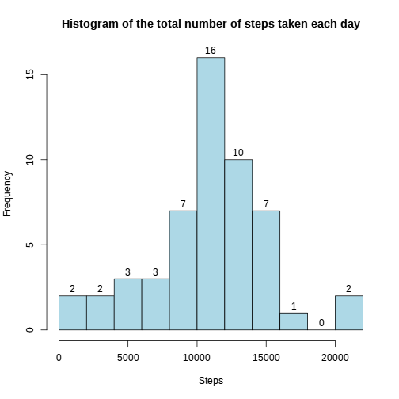
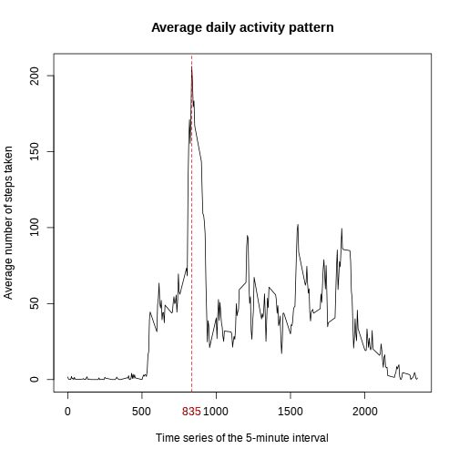

# Reproducible Research: Peer Assessment 1

## Data
 
* Dataset: [Activity monitoring data](https://d396qusza40orc.cloudfront.net/repdata%2Fdata%2Factivity.zip) [52K]

### The variables included in this dataset are:

* **steps**: Number of steps taking in a 5-minute interval (missing
    values are coded as `NA`)

* **date**: The date on which the measurement was taken in YYYY-MM-DD
    format

* **interval**: Identifier for the 5-minute interval in which
    measurement was taken

The dataset is stored in a comma-separated-value (CSV) file and there
are a total of 17,568 observations in this dataset.

## Loading and preprocessing the data

```r
activitydata <- read.csv("activity.csv", colClasses = c("integer", "Date", "integer"))
str(activitydata)
```

```
## 'data.frame':	17568 obs. of  3 variables:
##  $ steps   : int  NA NA NA NA NA NA NA NA NA NA ...
##  $ date    : Date, format: "2012-10-01" "2012-10-01" ...
##  $ interval: int  0 5 10 15 20 25 30 35 40 45 ...
```

```r
summary(activitydata)
```

```
##      steps            date               interval   
##  Min.   :  0.0   Min.   :2012-10-01   Min.   :   0  
##  1st Qu.:  0.0   1st Qu.:2012-10-16   1st Qu.: 589  
##  Median :  0.0   Median :2012-10-31   Median :1178  
##  Mean   : 37.4   Mean   :2012-10-31   Mean   :1178  
##  3rd Qu.: 12.0   3rd Qu.:2012-11-15   3rd Qu.:1766  
##  Max.   :806.0   Max.   :2012-11-30   Max.   :2355  
##  NA's   :2304
```


## What is mean total number of steps taken per day?

```r
steps_bydate <- aggregate(steps ~ date, activitydata, sum)
hist(steps_bydate$steps, breaks = 10, col = "lightblue", xlab = "Steps", labels = TRUE, 
    main = "Histogram of the total number of steps taken each day")
```

 


### Mean/Median total number of steps taken per day:

```r
mm <- with(steps_bydate, c(mean = mean(steps), median = median(steps)))
mm
```

```
##   mean median 
##  10766  10765
```


## What is the average daily activity pattern?


```r
steps_byinterval <- aggregate(steps ~ interval, activitydata, mean)
maxsteps_byinterval <- steps_byinterval[which.max(steps_byinterval$steps), ]

plot(steps_byinterval, type = "l", xlab = "Time series of the 5-minute interval", 
    ylab = "The average number of steps taken", main = "The average daily activity pattern")
i <- maxsteps_byinterval$interval
abline(v = i, col = 2, lty = 2)
mtext(side = 1, text = i, col = 2, at = i, line = 1)
```

 


The 5-minute interval, on average across all the days in the dataset, contains the maximum number of steps:

```
##     interval steps
## 104      835 206.2
```


## Imputing missing values

The total number of missing values in the dataset:

```r
sum(is.na(activitydata))
```

```
## [1] 2304
```

>A new dataset that is equal to the original dataset but with the missing data filled in.(using the mean for that 5-minute interval)

```r
activity <- activitydata
activity$steps <- as.integer(lapply(1:nrow(activity), function(i) {
    x <- activity$steps[i]
    if (is.na(x)) with(steps_byinterval, steps[interval == activity$interval[i]]) else x
}))
```

>**With the new dataset,**

### What is mean total number of steps taken per day?

```r
steps_bydate_new <- aggregate(steps ~ date, activity, sum)
hist(steps_bydate_new$steps, breaks = 10, col = "lightblue", xlab = "Steps", 
    labels = TRUE, main = "Histogram of the total number of steps taken each day")
```

 


### Mean/Median total number of steps taken per day:

```r
mm_new <- with(steps_bydate_new, c(mean = mean(steps), median = median(steps)))
mm_new
```

```
##   mean median 
##  10750  10641
```

This strategy for imputing missing values shifts mean and median lower.

```r
mm_new - mm
```

```
##    mean  median 
##  -16.42 -124.00
```


## Are there differences in activity patterns between weekdays and weekends?
